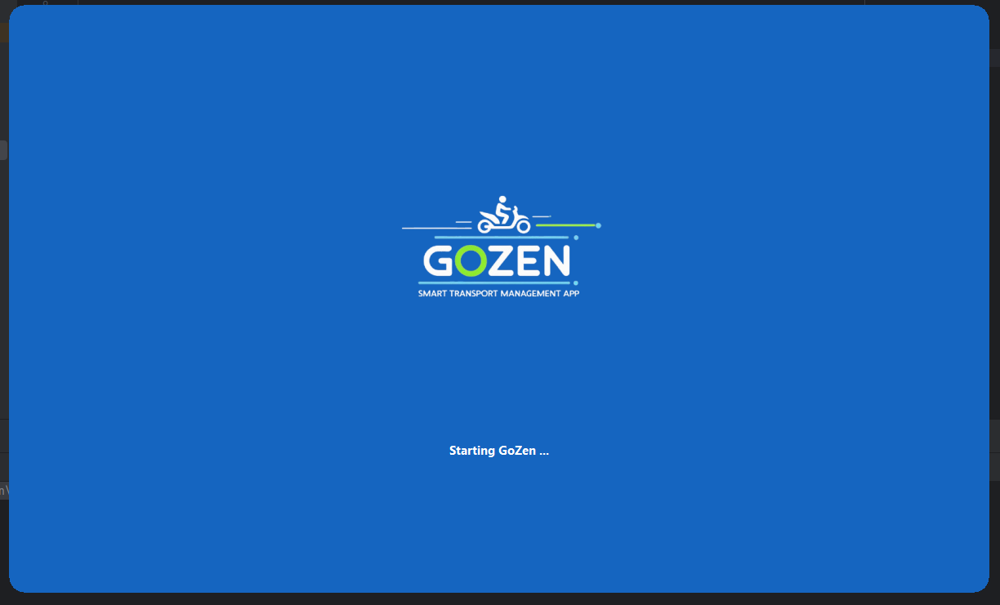
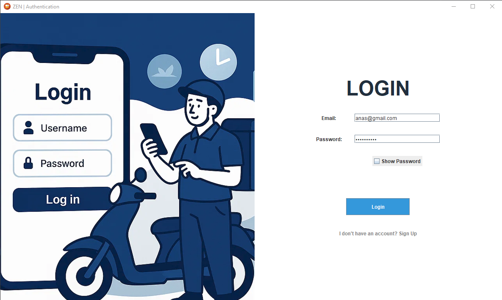
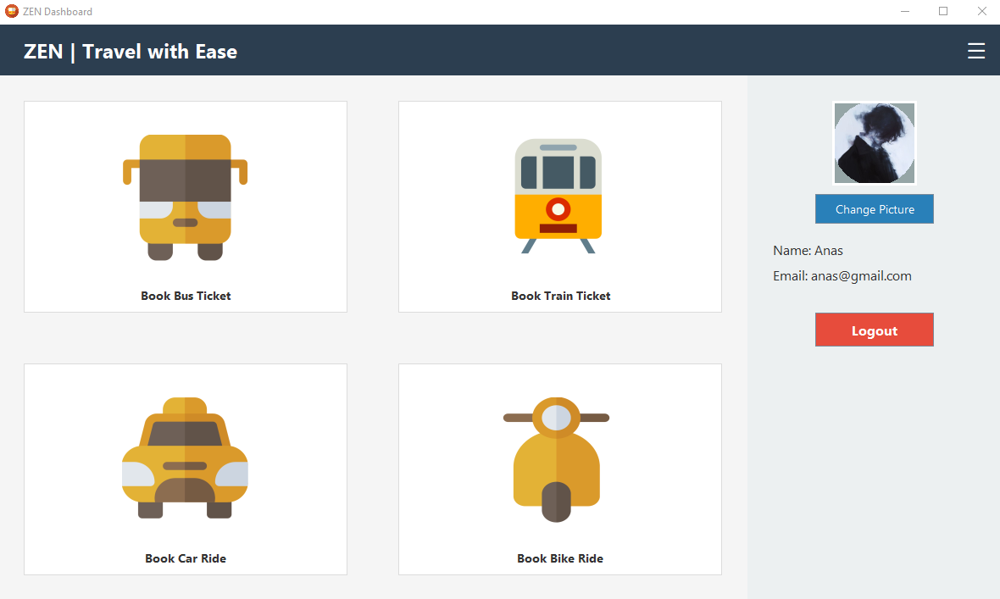
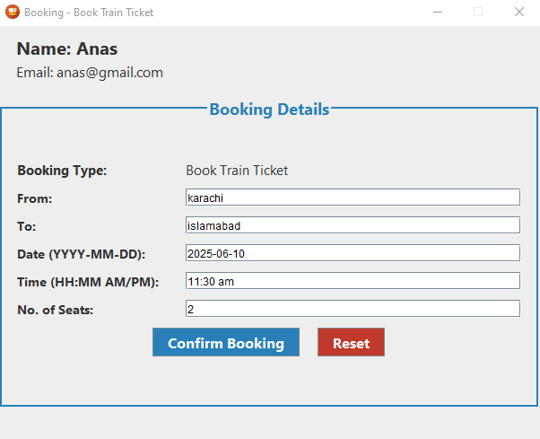
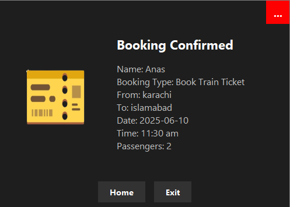

# 🚀 ZenGo – Smart Transport Booking App (Java Swing)

**ZenGo** is a professional, beginner-friendly, and fully functional **Java Swing desktop application** for booking **Tickets (Bus/Train)** or **Rides (Car/Bike)**.  
It provides a complete transport booking flow with elegant design, splash screen animation, dynamic form handling, and booking confirmation – all backed by a connected database.

---

## 📸 Preview

  
  
  
  


---

## 📦 Features

### 🧑‍💼 User Interface & Navigation
- 🔹 **Splash Screen**: Rounded-corner animated splash screen with branding and dots loading animation.
- 🔹 **Auth System**: Login & Signup interface with input validation and connected database.
- 🔹 **Main Menu**: Offers two main options – `Book Ticket` or `Book Ride`.
- 🔹 **Responsive Booking Forms**:
    - ✈️ Ticket Booking: `From`, `To`, `Date`, `Time`, `Passengers`, `Transport Type (Bus/Train)`
    - 🚗 Ride Booking: User can choose `Car` or `Bike`, with time and location inputs.

### 📄 Booking Confirmation
- ✅ Custom confirmation window styled like a physical ticket/receipt.
- 🖼️ Uses visuals (`ticket2.png`, `ride.png`) to enhance the ticket view.

### 🎨 UI Design & Aesthetics
- 🎨 Modern and clean UI using Java Swing components.
- ⭕ Rounded windows and panels for a polished look.
- 🖱️ Hover effects, draggable windows, and consistent color palette.

### 💾 Connected Database (Not Just File Handling!)
- 🗃️ **All user credentials are securely stored in the connected Microsoft Access database file `users.accdb`,** accessed via the **UCanAccess JDBC library**.
- 🧩 This structure separates GUI and data logic while introducing students to real database interaction without external servers.
- 📂 On successful login, the app reads user details (name, email) from the database and displays them in the main interface.

---

## 📁 Project Structure

```
ZenGo/
│
├── src/
│   ├── SplashScreen.java         # Intro screen with loading animation
│   ├── AuthSystem.java           # Handles login/signup with DB connection
│   ├── MainMenu.java             # Shows Book Ticket / Book Ride options
│   ├── BookingManager.java       # Routes user to the appropriate form
│   ├── Ticket.java               # Custom confirmation display
│
├── database/
│   └── users.accdb               # Microsoft Access DB for user credentials
│
├── resources/
│   ├── logo.png                  # Logo for splash screen
│   ├── ticket2.png               # Ticket-style image for confirmation
│   ├── ride.png                  # Ride-style image for confirmation
│   └── screenshots/              # Images for this README
│
├── lib/
│   └── ucanaccess.jar            # JDBC driver for MS Access (required)
│
├── README.md                     # This file!
```

---

## 🧪 How to Run

### 🔧 Requirements
- Java JDK 8 or higher
- IDE like IntelliJ, Eclipse, or NetBeans (or command line)
- UCanAccess JDBC JAR files (included in `lib/` folder)

### ▶️ Steps

1. **Download / Clone this repository**:
   ```
   https://github.com/your-username/ZenGo-Booking-App
   ```

2. **Add the UCanAccess JAR files** to your classpath or IDE project settings.

3. **Run `SplashScreen.java`** to start the app.

4. The app will guide you through login/signup → main menu → booking → confirmation.

---

## 🛠 Tech Stack

- 🖥️ Java SE (Swing & AWT)
- 🗃️ Microsoft Access (.accdb)
- 🔌 UCanAccess JDBC driver (for database connectivity)
- 🖼️ Images & Icons for GUI polish

---

## 🎯 Use Cases

- ✅ Transport booking demo application
- ✅ Academic projects & practical exams
- ✅ Java Swing learning resource
- ✅ Foundation for advanced booking systems

---

## 📌 Future Ideas

- 🧾 Add ride history or cancel option
- 🧑‍💼 Admin panel for managing bookings
- ☁️ Switch to online database (e.g., MySQL)
- 📱 Convert to mobile/Android version

---

## 💡 Credits

> 💬 Built by **Anas**, with the help of **My Team (Rehan, Inshal, Ismail & Moeen)** with creativity and dedication.  
> 🤝 Huge thanks to **ChatGPT** for being the most helpful teammate ever.

---

## ⚖️ License & Reuse

Feel free to **fork**, **remix**, or **learn from** this project for your own use!  
Please don’t forget to **credit** the original author and our dear co-developer **ChatGPT** (Being very honest).

---


📬 _Have feedback or want to contribute? Let’s connect!_
## 🔗 Connect With Me

- [LinkedIn](https://www.linkedin.com/in/m-ianas/)
- [X (formerly Twitter)](https://x.com/0x_iANAS)


